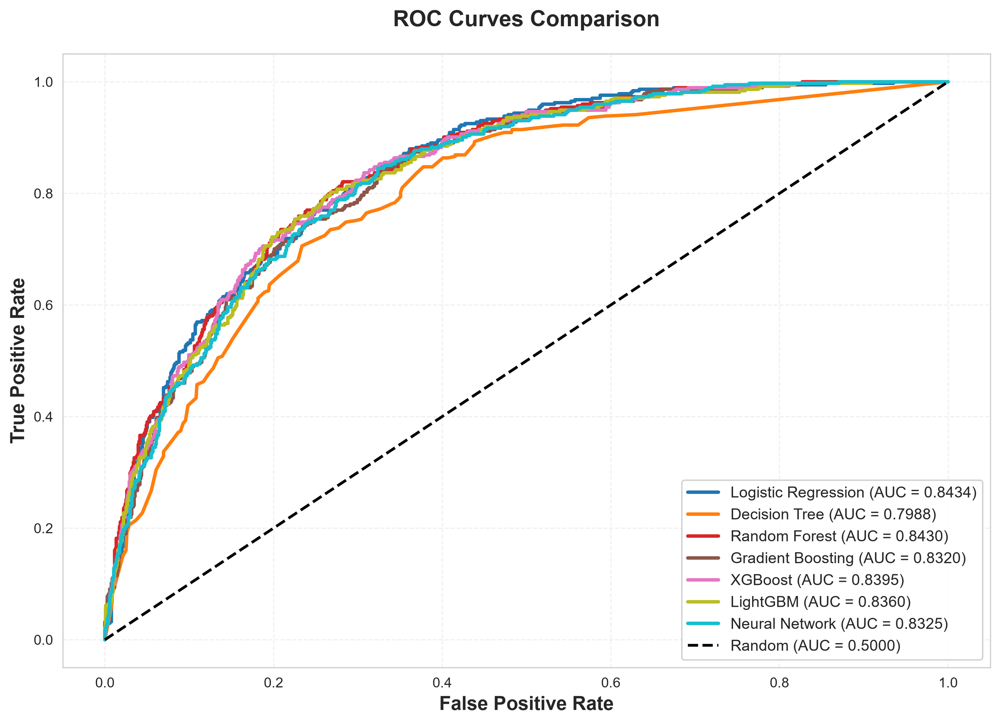
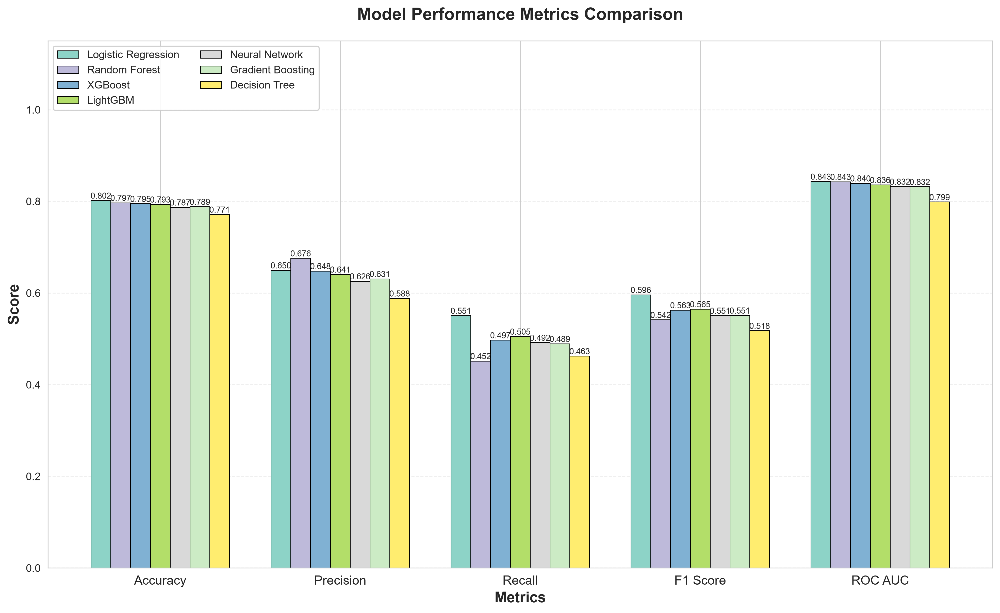
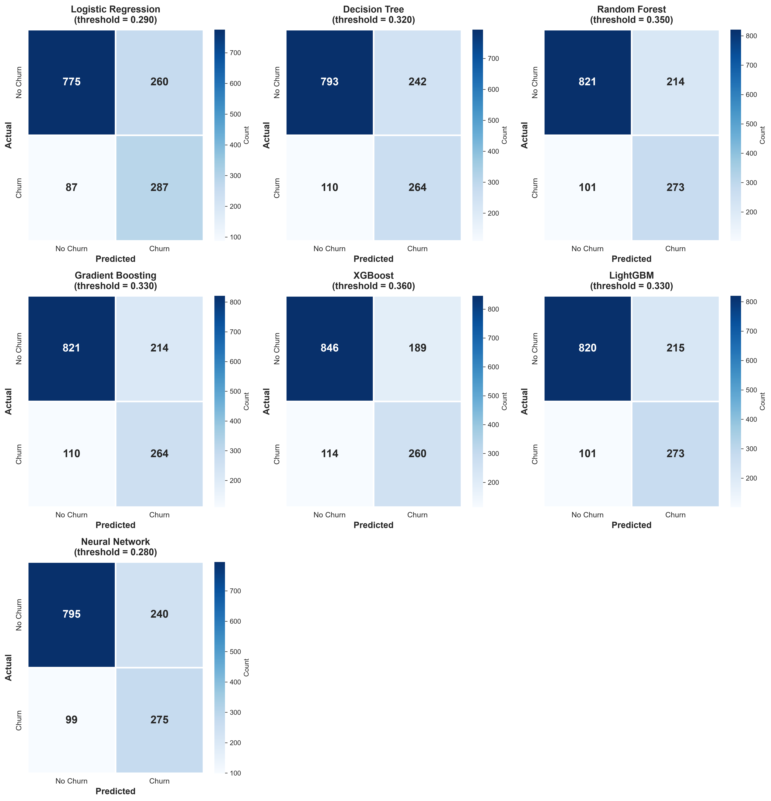
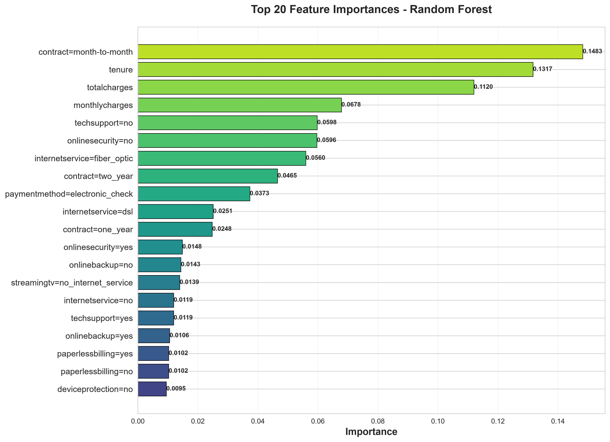

# Customer Churn Prediction: Mathematical Foundations and Model Analysis

Binary classification project: given the profile of a telecom customer, estimate the probability that the customer **leaves** (`churn = 1`) or **stays** (`churn = 0`). Seven models are compared (Logistic Regression, Decision Tree, Random Forest, Gradient Boosting, XGBoost, LightGBM, Neural Network).

The goal of this document is not to describe the code but to explain **why each method works**: which problem it solves, what the underlying mathematics is, and what the results in `results/plots/` tell us when read with that mathematics in mind.

---

## Table of contents

1. [Notation and definitions](#1-notation-and-definitions)
2. [Problem-solving roadmap](#2-problem-solving-roadmap)
3. [Data: from raw table to model input](#3-data-from-raw-table-to-model-input)
4. [Common framework: probabilities, loss, and generalization](#4-common-framework-probabilities-loss-and-generalization)
5. [Models](#5-models)
6. [Model selection and hyperparameter search](#6-model-selection-and-hyperparameter-search)
7. [Decision theory: choosing the threshold](#7-decision-theory-choosing-the-threshold)
8. [Evaluation metrics](#8-evaluation-metrics)
9. [Results and critical reading of the plots](#9-results-and-critical-reading-of-the-plots)
10. [Limitations](#10-limitations)
11. [Reproduction and further reading](#11-reproduction-and-further-reading)

---

## 1. Notation and definitions

Every symbol used in the document is defined here once, with its expression and its meaning.

| Symbol | Expression / value | Meaning |
|---|---|---|
| $n$ | $n_{\text{train}} = 4225$, $n_{\text{val}} = 1409$, $n_{\text{test}} = 1409$ | number of customers in a data subset |
| $d$ | $d = 45$ | number of input features after encoding |
| $x_i$ | $x_i \in \mathbb{R}^{d}$ | feature vector of customer $i$ (contract type, tenure, charges, ...) |
| $y_i$ | $y_i \in \{0,1\}$ | true label: 1 if the customer churned |
| $\pi$ | $\pi = \mathbb{P}(y=1) \approx 374/1409 \approx 0.265$ | **prior**: proportion of churners in the population |
| $p(x)$ | $p(x) = \mathbb{P}(y=1 \mid x)$ | **true** probability of churn for a customer with profile $x$ (unknown) |
| $\hat p(x)$ | model output in $[0,1]$ | **estimated** probability of churn |
| $t$ | $t \in [0,1]$ | decision threshold: predict churn if $\hat p(x) \ge t$ |
| $\hat y(x)$ | $\hat y(x) = \mathbb{1}[\hat p(x) \ge t]$ | predicted label |
| $\sigma(z)$ | $\sigma(z) = \dfrac{1}{1+e^{-z}}$ | sigmoid: maps a real score $z$ (a log-odds) to a probability |
| $\ell(y,\hat p)$ | $-y\log\hat p-(1-y)\log(1-\hat p)$ | per-sample loss (log-loss): penalizes confident wrong predictions heavily |
| $\theta$ | weights, thresholds, ... | parameters learned from data |
| $\mathbb{1}[A]$ | 1 if $A$ true, else 0 | indicator function |
| TP, FP, TN, FN | counts | true/false positives and negatives of the confusion matrix |

---

## 2. Problem-solving roadmap

Each methodological choice in the project answers a concrete problem. This table is the map of the document.

| Problem encountered | Mathematical tool used | Section |
|---|---|---|
| Only about 26.5 % of customers churn, so accuracy is misleading | precision, recall, $F_1$, ROC/AUC | 8 |
| We need an honest estimate of future performance | train / validation / test split, stratification, cross-validation | 3.2, 6 |
| Categorical variables cannot be fed to a numeric model | one-hot indicators | 3.3 |
| Features live on very different scales | standardization, conditioning argument | 3.4 |
| We want probabilities, not only labels | Bernoulli likelihood, log-loss | 4.1 |
| A model can memorize the training set | bias-variance trade-off, regularization | 4.2 |
| A single tree is unstable | bagging (variance reduction), boosting (bias reduction) | 5.3 to 5.6 |
| Interactions between features are non linear | trees, neural network | 5.2, 5.7 |
| Many hyperparameters, expensive training | cross-validation, random search | 6 |
| A missed churner and a false alarm do not cost the same | Bayes-optimal threshold | 7 |
| Several models have nearly identical scores | standard error, confidence intervals | 8.5, 9 |

---

## 3. Data: from raw table to model input

### 3.1 Target and class imbalance

$$
y_i = \mathbb{1}[\text{churn}_i = \text{"yes"}], \qquad \pi = \frac{n_+}{n} \approx 0.265
$$

Here $n_+$ is the number of churners. The test set contains 374 churners out of 1409 customers.

**Consequence.** A trivial model that always predicts "stays" has accuracy $1-\pi \approx 0.735$. Any useful model must be judged against this baseline, and accuracy alone cannot be the criterion.

### 3.2 Train / validation / test split

```
Dataset (7,043)
  Test        20 %  (1,409)   final unbiased evaluation
  Train_full  80 %  (5,634)
    Train     60 %  (4,225)   fit the parameters theta
    Val       20 %  (1,409)   early stopping, neural-network selection
```

**Why three sets.** The error measured on the data used for fitting is optimistically biased: the model has seen those labels. Hyperparameters chosen on a set also adapt to that set. A final set never used for any decision is the only way to get an unbiased estimate of future performance.

**Why stratified.** Each subset keeps the same prior $\pi$. Otherwise a small subset could have, by chance, a different churn rate and shift all metrics.

**Precision of the estimate.** A proportion estimated on $n$ samples has standard error $\sqrt{a(1-a)/n}$. For an accuracy around 0.80 on 1409 test samples:

$$
\mathrm{SE} \approx \sqrt{\frac{0.8 \times 0.2}{1409}} \approx 0.011
$$

Differences of about one point between two models are therefore not meaningful. This idea is used again in §9.

### 3.3 Encoding categorical variables: one-hot

For a categorical variable $c$ with levels $1,\dots,K$:

$$
x_{c=k} = \mathbb{1}[c = k], \qquad k = 1,\dots,K
$$

**Why not integer codes.** Coding `month-to-month, one-year, two-year` as $0,1,2$ would impose an order and equal spacing, and a linear model would be forced to assume that going from 0 to 1 has the same effect as going from 1 to 2. One-hot gives each level its own free coefficient.

The 15 categorical variables produce 41 binary columns, and with the 4 numeric ones (`seniorcitizen`, `tenure`, `monthlycharges`, `totalcharges`) we get $d = 45$. Since $\sum_k x_{c=k} = 1$, the dummies of one variable are perfectly collinear. This is harmless for trees and the neural network, and the penalty of the logistic regression makes its solution unique.

### 3.4 Standardization

$$
x'_{ij} = \frac{x_{ij}-\mu_j}{\sigma_j}, \qquad
\mu_j = \frac1n\sum_{i=1}^n x_{ij}, \qquad
\sigma_j^2 = \frac1n\sum_{i=1}^n (x_{ij}-\mu_j)^2
$$

Here $\mu_j$ is the mean and $\sigma_j$ the standard deviation of feature $j$ on the **training set**. The result $x'_{ij}$ is a z-score: the number of standard deviations separating the value from the mean.

**Problem solved: conditioning.** Fitted statistics from `scaler.pkl` show how different the scales are:

| Feature | Mean | Variance |
|---|---:|---:|
| `totalcharges` | 2287.8 | $5.19\times 10^{6}$ |
| `monthlycharges` | 64.8 | 899 |
| `tenure` | 32.3 | 608 |
| a binary column (`contract=month-to-month`) | 0.55 | 0.25 |

For a loss that is locally quadratic with Hessian $H \propto X^\top X$, gradient descent converges at a rate governed by the condition number $\kappa = \lambda_{\max}/\lambda_{\min}$. With variances ranging from $0.25$ to $5\times10^6$, $\kappa$ is of order $10^{7}$ and the descent zig-zags along the steep directions. After standardization all variances equal 1 and $\kappa$ only depends on feature correlations. This matters for the neural network (gradient-based), and for any penalized model, because the penalty $\|w\|^2$ depends on the units of each feature.

**Why trees are exempt.** A split `x_j <= s` depends only on the **ordering** of the values of $x_j$, and standardization is monotonic. The tree models therefore use the raw features.

**Leakage rule.** $\mu_j$ and $\sigma_j$ are computed on the training set only and reused on validation and test. Computing them on all the data would let the test set influence the preprocessing.

---

## 4. Common framework: probabilities, loss, and generalization

### 4.1 Why log-loss: likelihood and proper scoring

We model the label of a customer as a Bernoulli variable with parameter $\hat p(x)$:

$$
\mathbb{P}(y \mid x) = \hat p(x)^{y}\,\big(1-\hat p(x)\big)^{1-y}
$$

The likelihood of the training set is the product over customers and its negative logarithm is

$$
-\log \mathcal{L} = \sum_{i=1}^{n}\Big[-y_i\log\hat p_i - (1-y_i)\log(1-\hat p_i)\Big] = \sum_i \ell(y_i,\hat p_i)
$$

Maximum likelihood is therefore equivalent to minimizing the log-loss. Two properties make it the right choice.

**Proper scoring rule.** Fix $x$ with true probability $p$, and let the model answer $q$. The expected loss is $-p\log q-(1-p)\log(1-q)$. Its derivative in $q$ is $-\dfrac{p}{q}+\dfrac{1-p}{1-q}$, which vanishes exactly at $q = p$. Minimizing the log-loss therefore pushes $\hat p(x)$ toward the **true conditional probability**, not only toward the right label. This is what makes thresholds meaningful later (§7).

**Heavy penalty on confident mistakes.** $\ell \to \infty$ when $\hat p \to 0$ while $y = 1$. A model cannot afford to be sure and wrong.

### 4.2 Generalization and the bias-variance trade-off

We want to minimize the **expected risk** $R(f) = \mathbb{E}[\ell(y, f(x))]$, but we only have the **empirical risk** $R_n(f) = \frac1n\sum_i \ell(y_i, f(x_i))$. Minimizing $R_n$ on a flexible class overfits: $R_n$ becomes small while $R$ stays large.

For the squared error (the Brier score when applied to probabilities), the error at a fixed $x$ decomposes as

$$
\mathbb{E}\big[(y-\hat f(x))^2\big] = \underbrace{\sigma^2_{\text{noise}}}_{\text{irreducible}} + \underbrace{\big(\mathbb{E}\hat f(x) - f^*(x)\big)^2}_{\text{bias}^2} + \underbrace{\mathrm{Var}\big(\hat f(x)\big)}_{\text{variance}}
$$

- **Bias**: systematic error of the model class (a linear model cannot represent an interaction).
- **Variance**: sensitivity to the particular training sample (a deep tree changes completely if a few rows change).
- **Noise**: customer behavior not explained by the available features; no model can remove it.

This single decomposition organizes the whole project:

| Technique | Acts on | Mechanism |
|---|---|---|
| Deep single tree | low bias, high variance | very flexible |
| Bagging, Random Forest | variance | averaging decorrelated models |
| Boosting | bias | each tree corrects the residual errors |
| L1 / L2 penalty, `min_samples_leaf`, shrinkage, dropout, early stopping | variance (at the cost of some bias) | restrict effective model capacity |

The decomposition is exact for squared error and is used here as a qualitative guide for the log-loss.

---

## 5. Models

### 5.1 Overview

| Model | Hypothesis class | Main idea |
|---|---|---|
| Logistic Regression | log-odds linear in $x$ | convex likelihood maximization |
| Decision Tree | piecewise constant on a partition | greedy impurity reduction |
| Random Forest | average of trees | variance reduction by decorrelation |
| Gradient Boosting | sum of trees | gradient descent in function space |
| XGBoost | sum of trees | second-order, regularized objective |
| LightGBM | sum of trees | same objective, histogram and leaf-wise engineering |
| Neural Network | composition of affine maps and ReLU | learned non-linear representation |

### 5.2 Logistic Regression

**Problem.** Estimate $p(x)$ with a model that is simple, stable, and interpretable.

**Model.** Assume the **log-odds** are linear in the features:

$$
\log\frac{p(x)}{1-p(x)} = w^\top x + b
\qquad\Longleftrightarrow\qquad
p(x) = \sigma(w^\top x + b)
$$

where $w\in\mathbb{R}^d$ are the weights (one per feature) and $b$ the intercept. The odds $\frac{p}{1-p}$ measure how many times more likely churn is than staying.

**Gradient (derivation).** Let $z = w^\top x + b$ and $p = \sigma(z)$, with $\sigma'(z) = \sigma(z)(1-\sigma(z))$. For one sample:

$$
\frac{\partial \ell}{\partial z}
= -\frac{y}{p}\,p(1-p) + \frac{1-y}{1-p}\,p(1-p)
= -y(1-p) + (1-y)p = p - y
$$

By the chain rule, $\dfrac{\partial\ell}{\partial w} = (p-y)\,x$, and over the training set:

$$
\nabla_w \mathcal{L} = \sum_{i=1}^n (p_i - y_i)\,x_i
$$

The gradient is "prediction error times input": a weight increases when the model under-predicts churn on customers having that feature.

**Convexity (proof).** The Hessian is $H = X^\top S X$ with $S = \mathrm{diag}(s_i)$, $s_i = p_i(1-p_i) > 0$. For any vector $v$,

$$
v^\top H v = \sum_i s_i\,(x_i^\top v)^2 \ \ge\ 0
$$

so $H \succeq 0$: the loss is convex, there is no local-minimum problem, and Newton-type solvers (`lbfgs`) converge reliably.

**Regularization as a prior.** The penalized problems are

$$
\text{L2}: \ \min_{w,b}\ \tfrac12\|w\|_2^2 + C\sum_i \ell_i
\qquad\qquad
\text{L1}: \ \min_{w,b}\ \|w\|_1 + C\sum_i \ell_i
$$

Dividing the L2 objective by $C$ gives $\sum_i\ell_i + \frac{1}{2C}\|w\|^2$. This is exactly the negative log-posterior (MAP estimation) with a Gaussian prior $w_j \sim \mathcal{N}(0, C)$, so **$C$ is the prior variance**: small $C$ expresses a strong belief that weights are small. The L1 penalty corresponds to a Laplace prior, whose peak at zero explains why L1 produces exactly zero coefficients (feature selection) while L2 only shrinks them.

**Class weights.** `class_weight='balanced'` weights each class by $\dfrac{n}{2n_c}$, equivalent to training as if $\pi = 0.5$. If $\tilde p$ is the resulting probability, then $\frac{\tilde p}{1-\tilde p} = \frac{p}{1-p}\cdot\frac{1-\pi}{\pi}$, hence $\tilde p \ge 0.5 \iff p \ge \pi$. Balancing the classes is therefore the same as moving the decision threshold from 0.5 to $\pi \approx 0.27$. This anticipates §7.

**Interpretation: odds ratio.** Increasing $x_j$ by one unit multiplies the odds by $e^{w_j}$, because $\frac{p}{1-p} = e^{b}\prod_j e^{w_j x_j}$. Coefficients learned in `logistic_regression_model.pkl` (raw features):

| Feature | $w_j$ | $e^{w_j}$ | Reading |
|---|---:|---:|---|
| `contract=month-to-month` | +0.728 | 2.07 | odds of churn multiplied by about 2 |
| `internetservice=fiber_optic` | +0.471 | 1.60 | higher risk |
| `paymentmethod=electronic_check` | +0.226 | 1.25 | higher risk |
| `onlinesecurity=yes` | -0.186 | 0.83 | protective |
| `internetservice=dsl` | -0.442 | 0.64 | protective |
| `contract=two_year` | -0.815 | 0.44 | odds roughly halved |

### 5.3 Decision Tree (CART)

**Problem.** Capture non-linear effects and interactions (for example "month-to-month contract and short tenure") without specifying them by hand.

**Model.** The feature space is partitioned into regions $R_1,\dots,R_J$ by successive questions `x_j <= s`, and the prediction is constant on each region:

$$
\hat p(x) = \sum_{j=1}^{J} c_j\,\mathbb{1}[x\in R_j], \qquad c_j = \frac{n_{+}(R_j)}{n(R_j)}
$$

where $c_j$ is the fraction of churners among the training samples in region $R_j$. This is the maximum-likelihood estimate of a Bernoulli parameter on that region.

**Impurity.** For a node with churn fraction $p$:

$$
\text{Gini}(p) = 1 - \sum_k p_k^2 = 2p(1-p),
\qquad
\text{Entropy}(p) = -p\log_2 p - (1-p)\log_2(1-p)
$$

*Meaning of Gini*: the probability of misclassifying a sample drawn at random from the node if it is labeled at random according to the node's class proportions, $\sum_k p_k(1-p_k)$. *Meaning of entropy*: the average uncertainty (in bits) about the label of a sample in the node. Both are 0 for a pure node and maximal for $p = 0.5$.

**Split criterion.** For a candidate split into left and right children:

$$
\Delta I = I(S) - \frac{n_L}{n}\,I(S_L) - \frac{n_R}{n}\,I(S_R)
$$

$\Delta I\ge0$ always, by concavity of the impurity (Jensen's inequality): mixing two groups cannot be purer than the pure parts. The algorithm picks the split maximizing $\Delta I$. For a numeric feature, the candidate thresholds are the midpoints between sorted consecutive values; for a one-hot column the only useful threshold is 0.5. The search is **greedy**: it is locally optimal at each node with no look-ahead, because globally optimal tree construction is NP-hard.

**Variance of the leaf estimates.** A leaf with $m$ samples estimates a probability with standard error $\sqrt{c(1-c)/m}$, up to $0.5/\sqrt m$. With $m = 50$ the uncertainty is about $\pm 0.07$ on each leaf probability. This is the quantitative reason for `min_samples_split=50` and `min_samples_leaf`: leaves backed by few samples are noise.

**Hyperparameters as capacity controls** (`max_depth=10`, `min_samples_split=50` in the baseline): depth $d$ allows up to $2^d$ regions. Deeper means lower bias and higher variance. The single tree is the weakest model here (AUC 0.799), which is exactly what the variance term predicts.

### 5.4 Random Forest

**Problem.** A deep tree has low bias but high variance. We want to keep the low bias and remove the variance.

**Construction.** Train $B = 100$ trees. Each uses a bootstrap sample (draw $n$ rows with replacement) and, at each split, only a random subset of $m = \lfloor\sqrt d\rfloor = 6$ features (`max_features='sqrt'`). The prediction is the average:

$$
\hat p(x) = \frac1B\sum_{b=1}^{B}\hat p_b(x)
$$

**Variance of an average (derivation).** Let $T_b$ be identically distributed with variance $\sigma^2$ and pairwise correlation $\rho$. Then

$$
\mathrm{Var}\Big(\frac1B\sum_b T_b\Big)
= \frac{1}{B^2}\Big[B\sigma^2 + B(B-1)\rho\sigma^2\Big]
= \rho\,\sigma^2 + \frac{1-\rho}{B}\,\sigma^2
$$

- As $B\to\infty$, the second term vanishes, but the first term $\rho\sigma^2$ remains: **averaging cannot remove the variance shared by correlated trees**.
- So the key is to lower $\rho$. Bootstrap sampling makes trees differ, and the random choice of $m$ features per split prevents all trees from using the same dominant feature at the root.
- The bias does not change: it is that of a deep tree. Averaging only reduces variance.

**Bootstrap fact.** The probability that a given row is **not** drawn is $(1-\frac1n)^n \to e^{-1}\approx0.368$. Each tree therefore sees about 63.2 % of the distinct rows, and the remaining 36.8 % (out-of-bag) provide a free validation estimate (not activated here).

**Feature importance (Mean Decrease in Impurity).**

$$
\mathrm{Imp}(j) = \frac1B\sum_{b=1}^{B}\ \sum_{t\in b:\,v(t)=j}\frac{n_t}{n}\,\Delta I(t)
$$

where $v(t)$ is the variable used to split node $t$, $n_t/n$ the fraction of samples reaching it, and $\Delta I(t)$ the impurity decrease obtained there. The vector is normalized to sum to 1. The importance of a feature is the total impurity reduction it brings, weighted by how many samples it affects.

### 5.5 Gradient Boosting

**Problem.** Instead of reducing variance, reduce bias: build a model that corrects its own errors.

**Idea: gradient descent in function space.** We want a function $F$ minimizing $\sum_i\ell(y_i, F(x_i))$, where $F$ is a log-odds score and $\hat p=\sigma(F)$. Ordinary gradient descent updates parameters $\theta \leftarrow \theta - \eta\nabla_\theta L$. Here the "parameters" are the values $F(x_i)$ themselves, and the gradient with respect to them is

$$
\frac{\partial \ell}{\partial F(x_i)} = \sigma(F(x_i)) - y_i
$$

(the same computation as §5.2). The negative gradient, called the **pseudo-residual**, is $r_i = y_i - \hat p_i$: positive for a churner the model under-estimates, negative for a loyal customer it over-estimates. A regression tree $h_m$ is fitted on $(x_i, r_i)$ so that the correction **generalizes** to new points instead of existing only at training points.

**Algorithm.**

1. $F_0 = \log\dfrac{\pi}{1-\pi}$ (the best constant score: the base-rate log-odds).
2. For $m=1,\dots,M$: compute $r_{im} = y_i - \sigma(F_{m-1}(x_i))$, fit a tree $h_m$ on these residuals with leaf regions $R_{jm}$, and set each leaf value by a one-step Newton update:

$$
\gamma_{jm} = \frac{\sum_{i\in R_{jm}} r_{im}}{\sum_{i\in R_{jm}} p_i(1-p_i)}
$$

3. $F_m(x) = F_{m-1}(x) + \nu\sum_j\gamma_{jm}\mathbb{1}[x\in R_{jm}]$, and the final probability is $\hat p=\sigma(F_M)$.

**Meaning of the leaf value.** Expanding $\sum_{i\in R}\ell(y_i, F+\gamma)$ to second order in $\gamma$ gives the gradient $-\sum r_i$ and the curvature $\sum p_i(1-p_i)$; the minimizer is the ratio above, a Newton step.

**Role of the hyperparameters.**

| Parameter | Expression | Meaning |
|---|---|---|
| $M$ (`n_estimators`) | 100 | number of correction steps |
| $\nu$ (`learning_rate`) | 0.1 | **shrinkage**: only a fraction $\nu$ of each correction is applied; small $\nu$ means slower but smoother fit, which regularizes (more trees are needed) |
| `max_depth` | 5 | depth of each weak learner; controls the order of interactions it can capture (depth $k$ allows interactions among up to $k$ features) |
| `subsample` | 0.7 to 1.0 | fraction of rows per tree; injects randomness like bagging |

Random Forest averages **independent** trees to reduce variance. Boosting adds **dependent** trees, each fitted to what the previous ones got wrong, to reduce bias.

### 5.6 XGBoost

**Problem.** Boosting with fine control of complexity inside the objective itself, and a more accurate update than a first-order step.

**Regularized objective** at boosting step $t$:

$$
\mathcal{O}^{(t)} = \sum_{i=1}^n \ell\big(y_i, \hat y_i^{(t-1)} + f_t(x_i)\big) + \Omega(f_t),
\qquad
\Omega(f) = \gamma\,T + \tfrac12\lambda\sum_{j=1}^T w_j^2 + \alpha\sum_{j=1}^T |w_j|
$$

where $\hat y_i^{(t-1)}$ is the score before step $t$, $f_t$ the new tree, $T$ its number of leaves and $w_j$ the value (weight) of leaf $j$. The penalty charges a cost $\gamma$ per leaf, and $\lambda$, $\alpha$ penalize large leaf values.

**Second-order Taylor expansion.** Expanding the loss around $\hat y_i^{(t-1)}$ and dropping constants:

$$
\mathcal{O}^{(t)} \approx \sum_i\Big[g_i f_t(x_i)+\tfrac12 h_i f_t(x_i)^2\Big]+\Omega(f_t)
$$

$$
g_i = \frac{\partial\ell}{\partial\hat y_i} = p_i - y_i,
\qquad
h_i = \frac{\partial^2\ell}{\partial\hat y_i^2} = p_i(1-p_i)
$$

$g_i$ is the gradient (direction and size of the error), $h_i$ the curvature. Note that $h_i$ is maximal ($0.25$) for an uncertain sample ($p_i\approx0.5$) and small for a sample the model is already sure about.

**Optimal leaf weight (derivation, $\alpha = 0$).** Group samples by leaf and set $G_j = \sum_{i\in R_j}g_i$, $H_j=\sum_{i\in R_j}h_i$. Since $f_t(x_i) = w_j$ for $x_i\in R_j$, the objective becomes a sum of independent quadratics:

$$
\mathcal{O}^{(t)} = \sum_{j=1}^T\Big[G_jw_j+\tfrac12(H_j+\lambda)w_j^2\Big]+\gamma T
$$

Setting the derivative $G_j + (H_j+\lambda)w_j$ to zero:

$$
w_j^\star = -\frac{G_j}{H_j+\lambda},
\qquad
\mathcal{O}^\star = -\frac12\sum_{j=1}^T\frac{G_j^2}{H_j+\lambda}+\gamma T
$$

**Split gain.** Comparing $\mathcal{O}^\star$ for a leaf before and after splitting it into $L$ and $R$:

$$
\text{Gain} = \frac12\left[\frac{G_L^2}{H_L+\lambda}+\frac{G_R^2}{H_R+\lambda}-\frac{(G_L+G_R)^2}{H_L+H_R+\lambda}\right]-\gamma
$$

The split is kept only if $\text{Gain}>0$: **$\gamma$ is a pruning threshold built into the criterion**.

**What each hyperparameter does, mathematically.**

| Hyperparameter | Effect |
|---|---|
| `reg_lambda` $\lambda$ | adds to $H_j$ in the denominator: shrinks leaf values and stabilizes leaves with small curvature |
| `reg_alpha` $\alpha$ | replaces $G_j$ by $\mathrm{sign}(G_j)\max(\lvert G_j\rvert-\alpha,0)$: leaf weights with weak signal become exactly 0 |
| `gamma` $\gamma$ | minimum gain to accept a split |
| `min_child_weight` | minimum $\sum h_i$ in a child: requires enough "uncertain mass", not just enough samples |
| `learning_rate` $\eta$ | $\hat y^{(t)}=\hat y^{(t-1)}+\eta f_t$: shrinkage as in §5.5 |
| `subsample`, `colsample_bytree` | row / column sampling (decorrelation, as in bagging) |

### 5.7 LightGBM

LightGBM optimizes the same second-order objective as XGBoost; the differences are in how the trees are searched, which changes computational cost and the bias-variance behavior.

| Feature | Mathematical content |
|---|---|
| Histogram binning | each feature is discretized into `max_bin` (255) bins; the gains of §5.6 are evaluated from cumulated $(G,H)$ per bin, so split search costs $O(\#\text{bins})$ per feature instead of $O(n)$ |
| Subtraction trick | the histogram of a child equals parent minus sibling, so only the smaller child needs to be computed |
| Leaf-wise growth | at each step, split the leaf with the largest Gain anywhere in the tree (instead of all leaves of one level); for the same number of leaves the training loss decreases faster, but trees can become deep and asymmetric, hence higher overfitting risk |
| `num_leaves`, `min_child_samples` | the real capacity controls: number of leaves (keep $\le 2^{\text{max\_depth}}$) and minimum samples per leaf |

### 5.8 Neural Network

**Problem.** Learn non-linear feature combinations automatically, rather than relying on greedy partitions (trees) or a linear log-odds (logistic regression).

**Why non-linearity is necessary.** Stacking affine layers without activation gives an affine map: $W_2(W_1x+b_1)+b_2 = (W_2W_1)x+(W_2b_1+b_2)$, which is a logistic regression again. The ReLU activation $\max(0,z)$ makes the network a **piecewise-linear** function able to approximate any continuous function (universal approximation) given enough units.

**Architecture** $45\to128\to64\to32\to1$. For each hidden layer $\ell$:

$$
z^{(\ell)}=W^{(\ell)}h^{(\ell-1)}+b^{(\ell)},\qquad
\hat z^{(\ell)}=\gamma^{(\ell)}\odot\frac{z^{(\ell)}-\mu_B}{\sqrt{\sigma_B^2+\varepsilon}}+\beta^{(\ell)},\qquad
h^{(\ell)}=\mathrm{Dropout}\big(\max(0,\hat z^{(\ell)})\big)
$$

and the output is $\hat p=\sigma(w_{\text{out}}^\top h^{(3)}+b_{\text{out}})$.

**Parameter count.** $45\cdot128+128=5888$; BN $2\cdot128$; $128\cdot64+64=8256$; BN $2\cdot64$; $64\cdot32+32=2080$; BN $2\cdot32$; $32+1=33$. Total: **16,705**. With $n_{\text{train}}=4225$ there are about four parameters per sample: the model is over-parameterized, so regularization is not optional. The project combines dropout, batch normalization, weight decay and early stopping.

**Loss and backpropagation.** The loss is the same log-loss as before, averaged over a batch of size $B$:

$$
\mathcal{L}=-\frac1B\sum_{i=1}^B\Big[y_i\log\hat p_i+(1-y_i)\log(1-\hat p_i)\Big]
$$

Define the error signal $\delta^{(\ell)}=\partial\ell/\partial z^{(\ell)}$. At the output it is $\delta^{(L)}=\hat p-y$ (same derivation as §5.2). It is propagated backward by the chain rule (for the plain network, ignoring BN and dropout factors):

$$
\delta^{(\ell)}=\big(W^{(\ell+1)\top}\delta^{(\ell+1)}\big)\odot\mathbb{1}[z^{(\ell)}>0],
\qquad
\frac{\partial\ell}{\partial W^{(\ell)}}=\delta^{(\ell)}\,h^{(\ell-1)\top}
$$

The ReLU derivative is $\mathbb{1}[z>0]$: a unit that is inactive does not pass any gradient. By contrast, a sigmoid has $\sigma'\le 0.25$, so gradients shrink at every layer (vanishing gradient).

**Batch normalization.** During training, $\mu_B$ and $\sigma_B^2$ are the mean and variance of the current mini-batch, so each layer receives inputs with controlled scale (the same conditioning argument as §3.4, but applied at every depth). At inference, running averages (momentum 0.1) replace them. Because $\sigma_B^2$ is meaningless for a single sample, batches must have size greater than 1, which is why incomplete last batches are dropped (`drop_last=True`; $\lfloor4225/32\rfloor=132$ iterations per epoch).

**Dropout.** During training each unit is kept with probability $1-q$ and multiplied by $\frac1{1-q}$:

$$
\mathbb{E}\Big[\frac{m}{1-q}\,h\Big]=h,\qquad m\sim\mathrm{Bernoulli}(1-q)
$$

so the expected activation is unchanged and inference simply uses all units. It acts as training a large ensemble of sub-networks sharing weights, which reduces co-adaptation of units (a variance-reduction effect, in the spirit of §5.4).

**Adam optimizer.** With gradient $g_t$ at step $t$:

$$
m_t=\beta_1m_{t-1}+(1-\beta_1)g_t,\quad
v_t=\beta_2v_{t-1}+(1-\beta_2)g_t^2,\quad
\theta_t=\theta_{t-1}-\eta\frac{m_t/(1-\beta_1^t)}{\sqrt{v_t/(1-\beta_2^t)}+\epsilon}
$$

with $\beta_1=0.9$, $\beta_2=0.999$, $\eta=10^{-3}$. $m_t$ is an exponential moving average of the gradient (momentum: smooths noise from mini-batches), $v_t$ the same for the squared gradient (per-parameter step normalization: parameters with large gradients take smaller steps), and the factors $1-\beta^t$ correct the initialization bias toward zero. `weight_decay` $\lambda=10^{-5}$ adds $\lambda\theta$ to the gradient, which is an L2 penalty and, as in §5.2, a Gaussian prior on the weights.

**Early stopping.** After each epoch the validation AUC is computed. Training stops when it has not improved for `patience = 15` epochs (maximum 100). Stopping before the training loss reaches its minimum limits how far the weights move from their small initial values, which has a regularizing effect comparable to an L2 penalty.

---

## 6. Model selection and hyperparameter search

### 6.1 Parameters versus hyperparameters

Parameters ($w$, split thresholds, leaf values) are fitted by minimizing the training loss. Hyperparameters ($C$, `max_depth`, $\nu$, ...) define the model class and its capacity, and **cannot be chosen on the training loss** (a more flexible model always fits the training data better). They must be chosen on data not used for fitting.

### 6.2 Stratified K-fold cross-validation ($K=5$)

The training set is divided into $K$ folds with the same churn prior. For each configuration $\theta$ and each fold $k$, we fit on the other $K-1$ folds and compute the AUC on fold $k$:

$$
\mathrm{CV}(\theta)=\frac1K\sum_{k=1}^K\mathrm{AUC}_k(\theta),
\qquad
\mathrm{std}(\theta)=\sqrt{\frac1K\sum_k\big(\mathrm{AUC}_k-\mathrm{CV}\big)^2}
$$

$\mathrm{CV}(\theta)$ estimates the generalization AUC using all the data for both fitting and validation, which is more stable than a single split (averaging $K$ estimates reduces the variance of the estimate). It is slightly pessimistic because each fit uses only $(K-1)/K$ of the data. The best configuration is then refit on the whole training set.

### 6.3 Grid search versus random search

If hyperparameter $p$ takes $|V_p|$ values, the grid size is $\prod_p |V_p|$, which grows **exponentially** with the number of hyperparameters.

| Model | Grid size | Method used | Number of fits (5 folds) |
|---|---:|---|---:|
| Logistic Regression | 48 | exhaustive grid | 240 |
| Decision Tree | 600 | random, 20 draws | 100 |
| Random Forest | 1,920 | random, 20 draws | 100 |
| Gradient Boosting | 2,304 | random, 20 draws | 100 |
| XGBoost | 196,608 | random, 20 draws | 100 |
| LightGBM | 184,320 | random, 20 draws | 100 |

**Why random sampling works.** Usually only a few hyperparameters strongly affect performance. If $n$ configurations are drawn uniformly, the probability that at least one falls in the best fraction $q$ of the search space is

$$
\mathbb{P}(\text{at least one in top } q) = 1-(1-q)^n
$$

For $n=20$: $q=10\,\%\Rightarrow 0.878$ and $q=5\,\%\Rightarrow0.642$, independent of the grid size. The same argument applied to the neural network (15 configurations drawn among 180, selected on a single validation split) gives about 0.8 probability of reaching the top 10 %.

---

## 7. Decision theory: choosing the threshold

A model outputs $\hat p(x)$; the business needs a decision. The rule is $\hat y=\mathbb{1}[\hat p(x)\ge t]$.

### 7.1 Bayes-optimal threshold from costs

Let $C_{FP}$ be the cost of a false alarm (retention offer sent to a customer who would have stayed) and $C_{FN}$ the cost of a missed churner. For a customer with true probability $p$ of churning, the expected cost of each decision is

- predict churn: $(1-p)\,C_{FP}$
- predict stay: $p\,C_{FN}$

Predicting churn is preferable if $(1-p)C_{FP}\le p\,C_{FN}$, that is

$$
p\ \ge\ t^\star=\frac{C_{FP}}{C_{FP}+C_{FN}}
$$

When missing a churner is more costly than a false alarm ($C_{FN}>C_{FP}$), $t^\star<0.5$. For example $C_{FN}=5\,C_{FP}$ gives $t^\star=1/6\approx0.17$. This result is only valid if $\hat p\approx p$, which is why the proper-scoring property of §4.1 matters.

### 7.2 Optimal threshold for $F_1$

With the labels in terms of counts, $F_1=\dfrac{2\,TP}{(TP+FP)+P}$, where $P=TP+FN$ is the number of actual positives (fixed) and $TP+FP$ the number of predicted positives. Suppose we add to the predicted positives one customer with churn probability $p$. In expectation, $TP$ increases by $p$ and $TP+FP$ by 1. Write $a=TP$, $b=TP+FP$. The new $F_1$ is larger if

$$
\frac{2(a+p)}{b+1+P}>\frac{2a}{b+P}
\iff p\,(b+P)>a
\iff p>\frac{a}{b+P}=\frac{F_1}{2}
$$

So at the optimum, **a customer should be flagged if and only if $\hat p > F_1^\star/2$**, and the optimal threshold is $t^\star=F_1^\star/2$. With $F_1^\star\approx0.62$ to $0.63$ this predicts $t^\star\approx0.31$.

### 7.3 What the project does

`find_optimal_threshold` scans 81 thresholds from 0.10 to 0.90 and keeps the one maximizing $F_1$:

$$
t^\star=\arg\max_{t\in\{0.10,\,0.11,\dots,0.90\}}F_1(t)
$$

The values found (0.29 to 0.36) agree with the theoretical prediction of §7.2 ($\approx0.31$), and with the prior-shift argument of §5.2 ($\pi\approx0.27$). The default threshold $0.5$ is too high here because only 26.5 % of customers churn: churners tend to receive probabilities between 0.3 and 0.5 and are classified as "stays".

---

## 8. Evaluation metrics

### 8.1 Confusion matrix

| | Predicted stay ($\hat y=0$) | Predicted churn ($\hat y=1$) |
|---|:---:|:---:|
| **Actual stay ($y=0$)** | TN | FP |
| **Actual churn ($y=1$)** | FN | TP |

### 8.2 Definitions: expression and meaning

| Metric | Expression | Probabilistic meaning | Operational meaning |
|---|---|---|---|
| Accuracy | $\dfrac{TP+TN}{n}$ | $\mathbb{P}(\hat y=y)$ | fraction of correct decisions; baseline is $1-\pi=0.735$ |
| Precision | $\dfrac{TP}{TP+FP}$ | $\mathbb{P}(y=1\mid\hat y=1)$ | among flagged customers, share who really churn |
| Recall (TPR) | $\dfrac{TP}{TP+FN}$ | $\mathbb{P}(\hat y=1\mid y=1)$ | share of real churners that are caught |
| Specificity | $\dfrac{TN}{TN+FP}$ | $\mathbb{P}(\hat y=0\mid y=0)$ | share of loyal customers correctly left alone |
| FPR | $\dfrac{FP}{FP+TN}=1-\text{Specificity}$ | $\mathbb{P}(\hat y=1\mid y=0)$ | share of loyal customers wrongly flagged |
| FNR | $\dfrac{FN}{FN+TP}=1-\text{Recall}$ | $\mathbb{P}(\hat y=0\mid y=1)$ | share of churners missed |
| NPV | $\dfrac{TN}{TN+FN}$ | $\mathbb{P}(y=0\mid\hat y=0)$ | reliability of a "stays" prediction |
| $F_1$ | $\dfrac{2PR}{P+R}$ | harmonic mean of precision $P$ and recall $R$ | single score balancing the two |
| Lift | $\dfrac{\text{Precision}}{\pi}$ | ratio to random targeting | how many times better than contacting customers at random |

**Why a harmonic mean.** $\dfrac{1}{F_1}=\dfrac12\Big(\dfrac1P+\dfrac1R\Big)$. The mean of the reciprocals is dominated by the smaller of $P$ and $R$, so a model cannot hide a very low recall behind a high precision, which an arithmetic mean would allow. Equivalent form: $F_1=\dfrac{2TP}{2TP+FP+FN}$ (it ignores TN, which is appropriate when TN dominates).

### 8.3 ROC curve and AUC

Let $S^+$ and $S^-$ be the score $\hat p(x)$ of a random churner and a random non-churner. Then

$$
\mathrm{TPR}(t)=\mathbb{P}(S^+\ge t),\qquad \mathrm{FPR}(t)=\mathbb{P}(S^-\ge t)
$$

The ROC curve is the parametric curve $t\mapsto(\mathrm{FPR}(t),\mathrm{TPR}(t))$, from $(0,0)$ at $t=1$ to $(1,1)$ at $t=0$. The AUC is the area under it, and it has a probabilistic interpretation:

$$
\mathrm{AUC}=\int_0^1\mathrm{TPR}\ d(\mathrm{FPR})=\mathbb{P}(S^+>S^-)
=\frac{1}{n_+n_-}\sum_{i\in+}\sum_{j\in-}\Big[\mathbb{1}(\hat p_i>\hat p_j)+\tfrac12\mathbb{1}(\hat p_i=\hat p_j)\Big]
$$

(Proof sketch: $\mathrm{FPR}(t)=\mathbb{P}(S^->t)$, so $d(\mathrm{FPR})$ is minus the density of $S^-$; integrating $\mathbb{P}(S^+\ge t)$ against it gives $\mathbb{P}(S^+\ge S^-)$.)

**Meaning.** The probability that a randomly chosen churner is ranked above a randomly chosen loyal customer. 0.5 corresponds to random ranking, 1 to perfect ranking.

**Key property.** The AUC does not depend on any threshold: it measures the quality of the **ranking** only. This is why it is used for model selection (cross-validation, early stopping), whereas precision, recall and $F_1$ describe one chosen operating point.

### 8.4 Uncertainty of the metrics

A proportion $\hat r$ estimated on $m$ samples has standard error $\sqrt{\hat r(1-\hat r)/m}$.

- Recall of the logistic regression: $\hat r=0.767$, $m=n_+=374$, so $\mathrm{SE}=\sqrt{0.767\times0.233/374}\approx0.022$ and a 95 % interval is about $0.767\pm0.043$.
- Precision of the logistic regression: $\hat p=0.525$, $m=547$ flagged customers, $\mathrm{SE}\approx0.021$.
- AUC around 0.84 with 374 positives and 1035 negatives: $\mathrm{SE}\approx0.013$ (normal approximation of Hanley and McNeil).

### 8.5 Consequence

Differences of about 0.01 in AUC or $F_1$ between two models are **below the noise level** of a 1409-sample test set. Ranking models on such differences would be over-interpreting the data; this is taken into account in §9.

---

## 9. Results and critical reading of the plots

### 9.1 Metrics at threshold 0.5: `results/reports/model_comparison.csv`

| Model | Accuracy | Precision | Recall | F1 | AUC | Optimal $t$ | Optimal F1 |
|---|---:|---:|---:|---:|---:|---:|---:|
| Logistic Regression | 0.8020 | 0.6498 | 0.5508 | 0.5962 | 0.8434 | 0.29 | 0.6232 |
| Random Forest | 0.7970 | 0.6760 | 0.4519 | 0.5417 | 0.8430 | 0.35 | 0.6341 |
| XGBoost | 0.7949 | 0.6481 | 0.4973 | 0.5628 | 0.8395 | 0.36 | 0.6318 |
| LightGBM | 0.7935 | 0.6407 | 0.5053 | 0.5650 | 0.8360 | 0.33 | 0.6334 |
| Neural Network | 0.7878 | 0.6147 | 0.5374 | 0.5735 | 0.8330 | 0.32 | 0.6231 |
| Gradient Boosting | 0.7885 | 0.6310 | 0.4893 | 0.5512 | 0.8320 | 0.33 | 0.6197 |
| Decision Tree | 0.7715 | 0.5884 | 0.4626 | 0.5180 | 0.7988 | 0.32 | 0.6000 |

### 9.2 ROC curves: `results/plots/roc_curves.png`



**Reading.**

- The six best curves are nearly superimposed (AUC from 0.832 to 0.843). With $\mathrm{SE}\approx0.013$ on each AUC, they are **statistically indistinguishable**.
- Interpretation through §4.2: with $n=4225$ training samples and $d=45$ features, the flexible models (boosting, neural network) have little extra signal to exploit beyond what a linear log-odds already captures. The ceiling is set by the information in the features (the noise term of the decomposition), not by the model class.
- The single decision tree (AUC 0.799) is clearly below: high variance, as predicted in §5.3. Bagging (RF) and boosting recover about 0.04 AUC.

### 9.3 Metrics at threshold 0.5: `results/plots/performance_comparison.png`



**Reading.**

- Accuracy (0.77 to 0.80) is only about 4 to 7 points above the naive baseline $1-\pi=0.735$.
- For every model **precision exceeds recall** (for example Random Forest: 0.676 vs 0.452). With $\pi=0.265$, few customers receive $\hat p\ge0.5$: the model flags only the clearest cases and misses about half of the churners. This is the quantitative symptom of the threshold problem of §7.3, not a weakness of one particular model.

### 9.4 Confusion matrices at the optimal threshold: `results/plots/confusion_matrices.png`



Each model uses its own $F_1$-optimal threshold. Metrics are recomputed from the displayed counts ($n=1409$, $n_+=374$, $\pi=0.2654$):

| Model | $t$ | TN | FP | FN | TP | Accuracy | Precision | Recall | $F_1$ | Lift |
|---|---:|---:|---:|---:|---:|---:|---:|---:|---:|---:|
| Logistic Regression | 0.29 | 775 | 260 | 87 | 287 | 0.7537 | 0.5247 | 0.7674 | 0.6232 | 1.98 |
| Decision Tree | 0.32 | 793 | 242 | 110 | 264 | 0.7502 | 0.5217 | 0.7059 | 0.6000 | 1.97 |
| Random Forest | 0.35 | 821 | 214 | 101 | 273 | 0.7764 | 0.5606 | 0.7299 | 0.6341 | 2.11 |
| Gradient Boosting | 0.33 | 821 | 214 | 110 | 264 | 0.7700 | 0.5523 | 0.7059 | 0.6197 | 2.08 |
| XGBoost | 0.36 | 846 | 189 | 114 | 260 | 0.7850 | 0.5791 | 0.6952 | 0.6318 | 2.18 |
| LightGBM | 0.33 | 820 | 215 | 101 | 273 | 0.7757 | 0.5594 | 0.7299 | 0.6334 | 2.11 |
| Neural Network | 0.32 | 788 | 247 | 93 | 281 | 0.7587 | 0.5322 | 0.7513 | 0.6231 | 2.01 |

**Reading.**

- **The trade-off is explicit.** Lowering $t$ from 0.5 to about 0.3 raises recall from roughly 0.45 to 0.55 up to 0.70 to 0.77, at the cost of precision and accuracy. This is the movement along the ROC curve of §8.3: a lower threshold moves toward the upper right.
- **Lift.** Contacting the flagged customers is about twice as efficient as contacting customers at random (lift between 1.97 and 2.18).
- **Operating points differ.** The logistic regression catches the most churners (287 of 374) but raises the most false alarms (260). XGBoost raises the fewest (189) with lower recall. They are different points of a similar underlying ranking, not necessarily different quality.
- **Uncertainty.** The $F_1$ values of the six best models span 0.620 to 0.634. With $\mathrm{SE}\approx0.02$, none of them can be declared better on this evidence alone.

**Illustration: the best model depends on the costs.** Suppose a false alarm costs $C_{FP}=1$ and a missed churner $C_{FN}=5$ (arbitrary illustrative values). Total cost $=FP\cdot1+FN\cdot5$:

| Strategy | Cost |
|---|---:|
| Flag nobody ($FN=374$) | 1870 |
| Flag everybody ($FP=1035$) | 1035 |
| Logistic Regression | 695 |
| Neural Network | 712 |
| Random Forest | 719 |
| LightGBM | 720 |
| XGBoost | 759 |
| Gradient Boosting | 764 |
| Decision Tree | 792 |

The models above use their $F_1$-optimal thresholds, which are not cost-optimal (the optimum would be $t^\star=1/6$, §7.1), so these numbers are indicative. They show that the ranking by cost can differ from the ranking by $F_1$: as soon as $C_{FN}>C_{FP}$, models with high recall (logistic regression, neural network) become more attractive.

### 9.5 Feature importance: `results/plots/feature_importance.png`



| Rank | Feature | MDI importance |
|---:|---|---:|
| 1 | `contract=month-to-month` | 0.1483 |
| 2 | `tenure` | 0.1317 |
| 3 | `totalcharges` | 0.1120 |
| 4 | `monthlycharges` | 0.0678 |
| 5 | `techsupport=no` | 0.0598 |
| 6 | `onlinesecurity=no` | 0.0596 |
| 7 | `internetservice=fiber_optic` | 0.0560 |
| 8 | `contract=two_year` | 0.0465 |
| 9 | `paymentmethod=electronic_check` | 0.0373 |
| 10 | `internetservice=dsl` | 0.0251 |

**Reading.**

- **Cross-validation of conclusions.** The same factors appear as the main drivers in the logistic regression (odds ratios of §5.2: month-to-month 2.07, fiber 1.60, two-year 0.44) and in the Random Forest. Two models of very different nature (a linear log-odds and a non-parametric partition) agree, which makes the conclusion more reliable than either alone.
- **Shared credit.** `totalcharges` is approximately `tenure` times `monthlycharges`, i.e. $\log(\text{total})\approx\log(\text{tenure})+\log(\text{monthly})$. The three variables carry overlapping information, so MDI **splits the credit** between them and the individual values do not measure isolated effects.
- **Equal importance for complementary columns.** `paperlessbilling=yes` and `paperlessbilling=no` have the same importance (0.0102): they are complementary one-hot columns, so every split on one is equivalent to a split on the other.
- **Known limitation of MDI.** It favors features with many possible thresholds (continuous variables) and is computed on the training data. Permutation importance (drop in validation score after shuffling a column) or Shapley values are more robust checks.

---

## 10. Limitations

Each point below is a methodological issue, with its mathematical reason.

1. **Threshold selected on the test set.** The threshold is the maximizer over 81 values of a noisy estimate of $F_1$ computed on the test labels. The maximum of noisy estimates is biased upward, so the reported "optimal $F_1$" is optimistic and the test set is no longer independent. Correct procedure: choose $t^\star$ on the validation set (or out-of-fold predictions), then apply it unchanged to the test set.
2. **Imputation before splitting.** The mean used for missing `totalcharges` is computed on the full dataset, which lets the test set influence the training data. It follows the same principle as the scaler (§3.4): every statistic must be fitted on the training data only. In the standard version of this dataset the missing values correspond to customers with `tenure = 0`, for which an imputation of 0 is also more coherent than the mean.
3. **Penalized logistic regression on unscaled features.** The penalty $\|w\|^2$ is not scale invariant: a feature in large units has small coefficients and is barely penalized, while a feature in small units is penalized strongly. The shrinkage therefore depends on the units, not only on the information in the feature. Standardizing before fitting solves this.
4. **Comparisons within the noise.** Differences below about 0.013 in AUC or 0.02 in $F_1$ are not significant (§8.4). Bootstrap confidence intervals on the test set would allow a statistical comparison.
5. **Calibration.** Tree ensembles and neural networks are not guaranteed to output calibrated probabilities. The threshold theory of §7 assumes $\hat p\approx p$; Platt scaling or isotonic regression, assessed with the Brier score, would make it rigorous.
6. **Unequal operating points.** `model_comparison.csv` (threshold 0.5) and the confusion matrices (optimal thresholds) are not directly comparable.

---

## 11. Reproduction and further reading

```bash
pip install -r requirements.txt
python train.py                  # default hyperparameters, evaluation, plots, saves top 3 models
python optimize.py               # random / grid search with cross-validation
python evaluate.py [--optimized] # reload saved models and regenerate reports
```

Random seed fixed to 42 throughout (split, models, cross-validation, random search). `vectorizer.pkl` and `scaler.pkl` must be used to transform any new data exactly as during training.

Further reading:

- Hastie, Tibshirani, Friedman, *The Elements of Statistical Learning*: bias-variance, logistic regression, trees, random forests, boosting.
- Goodfellow, Bengio, Courville, *Deep Learning*: backpropagation, Adam, batch normalization, dropout.
- Chen and Guestrin (2016), *XGBoost: A Scalable Tree Boosting System*: the objective and gain derived in §5.6.